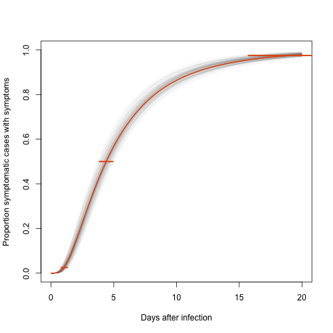

# Incubation period estimate for COVID-19

A recent <a href="https://annals.org/aim/fullarticle/2762808/incubation-period-coronavirus-disease-2019-covid-19-from-publicly-reported">study</a> published at the Annals of Internal Medicine from Lauer <I>et al.</I> used detailed COVID-19 case data to estimate the incubation period of the virus. They used 181 data points and they have made their data and R-code available in <a href="https://github.com/HopkinsIDD/ncov_incubation">this repository</a>.

More recently <a href="https://www.nature.com/articles/s41597-020-0448-0.pdf">Xu <I>et al.</I></a> published in Nature Scientific Data an ongoing collection of data with similar information as the study from Lauer <I>et al.</I>. In this repository I combined these two datasets and replicated the original COVID-19 incubation period study. 

Using the same accelerated failure time model (with lognormal distribution), I obtained the following fit: 

|        |    est|  CIlow| CIhigh|
|:-------|------:|------:|------:|
|meanlog |  1.481|  1.348|  1.598|
|sdlog   |  0.750|  0.655|  0.820|
|p2.5    |  1.010|  0.816|  1.306|
|p25     |  2.650|  2.274|  3.079|
|p50     |  4.395|  3.849|  4.942|
|p75     |  7.291|  6.371|  8.084|
|p97.5   | 19.131| 15.727| 21.981|

The bootstraped CDFs are shown in the following figure:

The median days for the incubation period is 4.4 days, with an average of 5.8 days. These estimates are fairly close to the ones obtained from Lauer <I>et al.</I> of 5 and 5.5 days respectively. 
